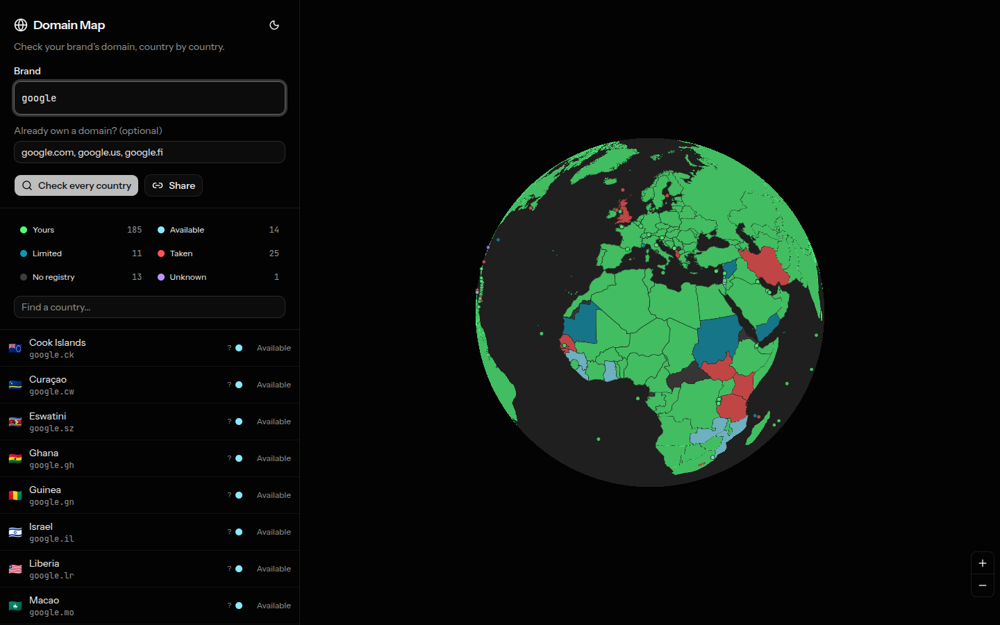

# Domain Map

Check one brand against every country's ccTLD, on a globe.



You own `google.fi`. Where else in the world is `google` still yours to take?
Type the domains you already own, and the map colours all ~250 countries by
whether the matching domain is yours, taken, free, or free-but-restricted.

No account, no database. Your list lives in your browser, and the Share button
puts it in a link.

## The six statuses

| Status | Meaning |
| --- | --- |
| **Yours** | Registered, and it looks like it belongs to you |
| **Taken** | Registered by someone else |
| **Available** | Unregistered, and anyone in the world can register it |
| **Limited** | Unregistered, but the registry requires local presence — residency, citizenship, a local company, or a national trademark |
| **No registry** | No ccTLD is delegated, or the registry does not sell to the public |
| **Unknown** | Every lookup source came back inconclusive |

**Limited** is the one that earns its place. A `.fr` nobody has taken is
still out of reach without an EU address, and `.au` wants an Australian
Business Number. That is a different planning decision from a domain you could
buy this afternoon, so it gets its own colour instead of being lumped in with
"available".

## How a status is decided

Two questions, answered from different sources.

**Is the domain registered?**

Three sources, tried in order and only as far as needed:

- **RDAP** — our own direct query to the registry's structured WHOIS
  successor, and definitive when it exists. Only about 70 of the ~250 ccTLDs
  publish one; `.se`, `.de`, `.io`, `.co`, `.dk`, `.it` and other popular
  registries do not.
- **DNS** — nameservers at the apex prove a domain is registered. Their
  *absence* is only evidence: a domain can be registered and never delegated,
  and from the outside that looks exactly like a free one. Results from here
  are marked low confidence, shown with a `?` in the list, and the detail
  panel says so.
- **WHOIS** — a last resort, reached only when RDAP has no server for the TLD
  *and* DNS came back genuinely inconclusive (a timeout or resolver error, not
  a clean "no such name" — those are already a confident answer from DNS
  alone). Goes through [who-dat](https://github.com/lissy93/who-dat), a free,
  open-source, unauthenticated WHOIS/RDAP proxy, so this never depends on an
  API key. It's a third party the app doesn't control, so it's marked low
  confidence too, and only ever consulted for the minority of domains the
  first two sources couldn't settle — never as the primary path, and never
  for every domain in a scan.

**Is it yours?**

Domains you list are yours by definition. For the rest there is no way to know
without authentication, so the app compares two public signals against your
listed domains: the registrant name, when the registry publishes one, and the
nameservers.

Nameserver matching has a sharp edge. Cloudflare gives each account its own
pair (`isla.ns.cloudflare.com`), so a match is meaningful; DigitalOcean gives
everyone the same three, so a match means nothing. The app tells those cases
apart and reports the weak ones as weak rather than dressing them up. Route 53
is the case it cannot catch at all — it assigns unique nameservers per zone, so
two domains in one AWS account share nothing.

So every verdict is overridable, and the override is trusted completely:
marking a country **It's mine** sets it to **Yours** outright, even if the
lookup itself came back "available" or "unknown" — you can't own a domain that
isn't registered, so saying it's yours settles both questions at once instead
of quietly being ignored because the automated check hadn't caught up.
**It's mine** / **Not mine** are available on any country with a ccTLD, and
the correction travels in the share link.

Registry eligibility rules live in `src/data/cctlds.ts` as a best-effort
snapshot — registries change their policies. Each country links to its IANA
delegation record, which is authoritative about who runs the TLD.

## Registering a domain you found

Countries marked **Available** or **Limited** get deep links to three
registrars, in `src/lib/registrars.ts`:

- **[Namecheap](https://namecheap.com)** — the default. Wraps in an affiliate
  link automatically once `NEXT_PUBLIC_NAMECHEAP_AFFILIATE_URL` is set (see
  `.env.example`); until then it's a plain, non-tracked link.
- **[Porkbun](https://porkbun.com)** — at-cost pricing, a good second quote.
- **[101domain](https://101domain.com)** — a specialist in the ccTLDs that
  need local presence, which Namecheap and Porkbun mostly don't carry. Shown
  with a note on **Limited** countries specifically.

None of these are guaranteed to carry every ccTLD — a name with a real local-
presence requirement may still need a registrar based in that country. These
are a reasonable first stop, not a promise.

## Running it

```bash
npm install
npm run dev
```

Then open http://localhost:3000.

```bash
npm run build      # production build
npm run lint       # eslint, zero warnings allowed
npm run typecheck  # tsc --noEmit
npm run build:geo  # regenerate the map geometry (see below)
```

## How it is built

- **Next.js 16** (App Router) with **Tailwind CSS 4** and **shadcn/ui**.
- **[mapcn](https://github.com/AnmolSaini16/mapcn)** for the map, in globe
  projection over a tile-less basemap. Countries are one GeoJSON fill layer
  coloured by a MapLibre `match` expression, and a second `match` on
  `fill-opacity` carries the legend filter onto the globe — picking "Free" dims
  everything that is not free rather than only shortening the list.
- The status palette is defined once, in `src/lib/domain-status.ts`. MapLibre
  paints outside the CSS cascade, so the same values are also emitted as custom
  properties into the document head and read back by the swatches in the DOM.
  Country fills sit at 72% opacity over the globe's grey, which keeps six
  colours reading as one set. "Limited" isn't an independent colour — it's
  computed as a darker, desaturated version of "Available" at load time, so
  the relationship holds by construction.
- `POST /api/lookup` runs RDAP, DNS, and (as a last resort) WHOIS lookups
  server-side — DNS needs the Node runtime, and RDAP endpoints do not send
  CORS headers. It reports registry facts only; deciding what is *yours*
  happens on the client, which keeps the route stateless and its answers
  cacheable.
- A full sweep is ~230 domains, split into batches of 30, three batches in
  flight at once. Each batch streams back one line of JSON per domain the
  moment its lookup finishes (NDJSON, 12 lookups in flight server-side per
  batch) rather than collecting everything into one response first —
  registries answer at wildly different speeds, and the fastest results land
  well under a second, so the globe starts painting almost immediately
  instead of sitting on a spinner. Batches stay small on purpose: one request
  covering the whole scan would mean a single slow or interrupted request
  could take a large chunk of the scan down with it — worse, on a host that
  kills a function past its own execution limit, an in-progress request just
  vanishes with no chance to close the stream cleanly, which reads as
  everything not yet answered failing at once. The route also closes its own
  stream after 9 seconds regardless of how many domains are left in that
  batch, so a pathologically slow domain can only ever cost that one batch,
  never the request hanging past whatever timeout the host enforces.

### Generated files

Two artefacts are generated rather than committed, so they stay in step with
their sources:

- `npm run build:geo` pulls Natural Earth 50m data, simplifies it, and writes
  `public/world.geojson` plus `src/data/country-points.json`. The points file
  exists because a globe cannot render Tuvalu at any useful size — roughly 100
  ccTLDs belong to islands and microstates that are sub-pixel, and those are
  exactly the ones people look for, so they are drawn as dots.
- `scripts/copy-maplibre-worker.mjs` copies MapLibre's web worker into
  `public/`. It runs from `predev`, `prebuild`, and `postinstall`. mapcn
  defaults to loading the worker from unpkg; served from our own origin the map
  no longer depends on a third-party CDN being reachable, which otherwise fails
  silently as an empty canvas.

## Limits worth knowing

- A DNS- or WHOIS-only "available" verdict is a strong hint, not a fact.
  Confirm with a registrar before you count on it.
- The WHOIS fallback depends on a free, community-run third-party proxy. If
  it's ever unreachable, affected domains fall back to whatever DNS already
  found — never worse than before this fallback existed, just not better for
  that one lookup. It's self-hostable if you want more control; see its repo.
- Ownership detection is a heuristic on public data. Correct it by hand — the
  correction is trusted completely, and travels in the share link.
- Eligibility rules are a snapshot. Follow the IANA link for the current policy.
- Second-level registries are handled (`google.com.br`, `google.co.za`),
  but a registry that sells at both levels is checked at one.
- Registrar deep links aren't guaranteed to carry every ccTLD; a name with a
  real local-presence requirement may still need a registrar based in that
  country.
